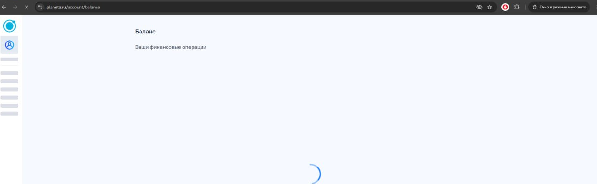
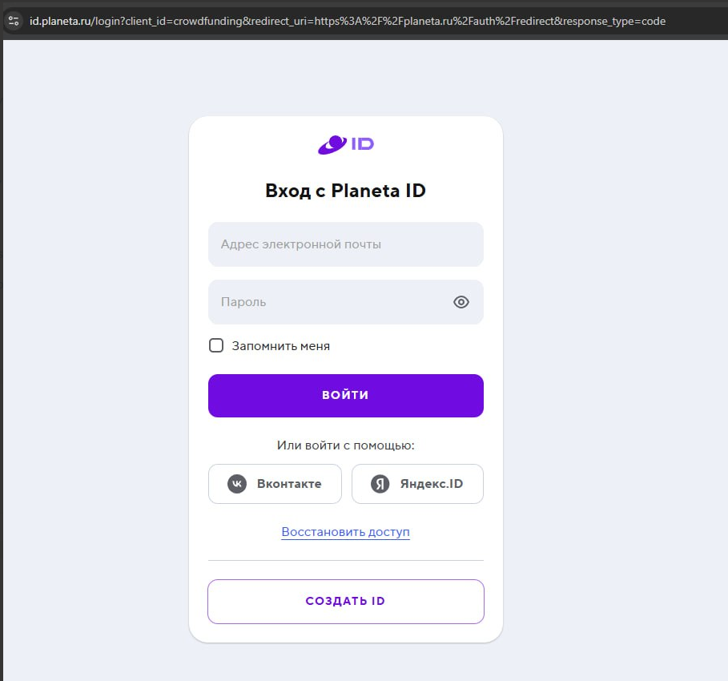

### 3 Лабораторная

### Часть 1

## Создание сертификата

```bash
sudo mkdir -p /etc/nginx/ssl

sudo openssl req -x509 -nodes -days 365 -newkey rsa:2048 \
-keyout /etc/nginx/ssl/nginx-selfsigned.key \
-out /etc/nginx/ssl/nginx-selfsigned.crt
```

Сертификат подключён в конфигурации nginx для работы по HTTPS (порт 443).

## Применение конфигурации:

```bash
sudo nginx -t
sudo systemctl reload nginx
```

## Первый проект

React-приложение доступно по адресу:

https://testbuild.local/testbuild

При открытии происходит автоматический переход с HTTP на HTTPS.


## Второй проект

Go backend доступен по адресу:

https://calc.local

Также настроено перенаправление на HTTPS.


## Использование alias

Создан файл:

```text
/home/xanadu/git/lab3/secret.txt
```

В nginx настроен доступ к этому файлу через alias по адресу:

https://calc.local/secret.txt


## Виртуальные хосты

В файл /etc/hosts были добавлены записи:

127.0.0.1 testbuild.local
127.0.0.1 calc.local

## В качестве дополнительного в проект добавлена страница 404 для calc

Показываем страницу 404 по несуществующему адресу


### Часть 2

Проверяем 

## ffuf

[WARN] Caught keyboard interrupt (Ctrl-C)

ffuf -u https://<здесь адрес из картинки выше>/FUZZ -w SecLists/Discovery/Web-Content/common.txt -fc 404

        /'___\  /'___\           /'___\
       /\ \__/ /\ \__/  __  __  /\ \__/
       \ \ ,__\\ \ ,__\/\ \/\ \ \ \ ,__\
        \ \ \_/ \ \ \_/\ \ \_\ \ \ \ \_/
         \ \_\   \ \_\  \ \____/  \ \_\
          \/_/    \/_/   \/___/    \/_/

       v2.1.0-dev

---

:: Method : GET
:: URL : https://<здесь адрес из картинки выше>/FUZZ
:: Wordlist : FUZZ: /home/xanadu/git/SecLists/Discovery/Web-Content/common.txt
:: Follow redirects : false
:: Calibration : false
:: Timeout : 10
:: Threads : 40
:: Matcher : Response status: 200-299,301,302,307,401,403,405,500
:: Filter : Response status: 404

---

:: Progress: [80/4751] :: Job [1/1] :: 0 req/sec :: Duration: [0:00:22] :: Errors: 40 ::

Явно есть защита от fuzz не могу пройти все проверки - валятся ошибки

## IDOR

Захожу без авторизации. Защита есть

редирект на авторизацию


## Path traversal

Запросы с разной глубиной ничего не вернули.

```
../../../../etc/passwd
../../../../../etc/passwd
../../../../../../../etc/passwd
```
