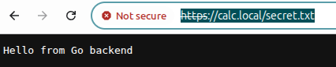
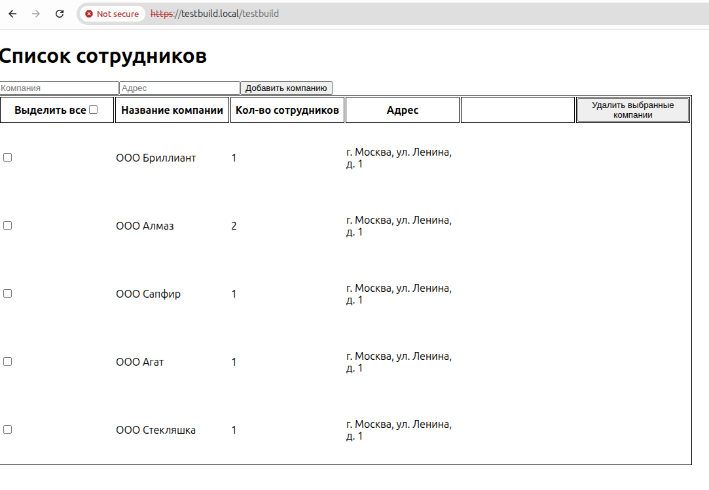
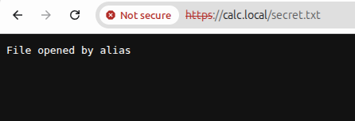
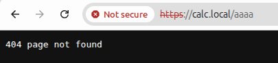

3 Лабораторная
1 часть

## Создание сертификата

```bash
sudo mkdir -p /etc/nginx/ssl

sudo openssl req -x509 -nodes -days 365 -newkey rsa:2048 \
-keyout /etc/nginx/ssl/nginx-selfsigned.key \
-out /etc/nginx/ssl/nginx-selfsigned.crt
```

Сертификат подключён в конфигурации nginx для работы по HTTPS (порт 443).

## Применение конфигурации:

```bash
sudo nginx -t
sudo systemctl reload nginx
```

## Первый проект

React-приложение доступно по адресу:

https://testbuild.local/testbuild

При открытии происходит автоматический переход с HTTP на HTTPS.



## Второй проект

Go backend доступен по адресу:

https://calc.local

Также настроено перенаправление на HTTPS.



## Использование alias

Создан файл:

```text
/home/xanadu/git/lab3/secret.txt
```

В nginx настроен доступ к этому файлу через alias по адресу:

https://calc.local/secret.txt



## Виртуальные хосты

В файл /etc/hosts были добавлены записи:

127.0.0.1 testbuild.local
127.0.0.1 calc.local

## В качестве дополнительного в проект добавлена страница 404 для calc

Показываем страницу 404 по несуществующему адресу


